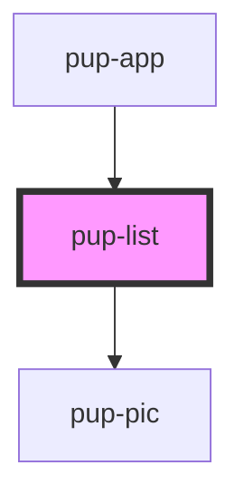

# pup-list

<!-- Auto Generated Below -->

## Properties

| Property | Attribute | Description | Type       | Default     |
| -------- | --------- | ----------- | ---------- | ----------- |
| `dogs`   | --        |             | `string[]` | `undefined` |

## Dependencies

### Used by

 - [pup-app](../pup-app)

### Depends on

- [pup-pic](../pup-pic)

### Graph

----------------------------------------------

*Built with [StencilJS](https://stenciljs.com/)*
