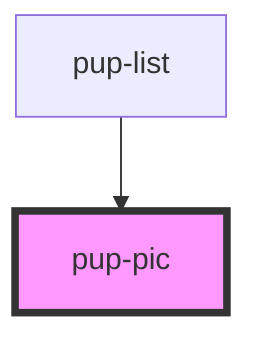

# pup-pic

<!-- Auto Generated Below -->

## Properties

| Property | Attribute   | Description | Type     | Default     |
| -------- | ----------- | ----------- | -------- | ----------- |
| `dogURL` | `dog-u-r-l` |             | `string` | `undefined` |

## Dependencies

### Used by

 - [pup-list](../pup-list)

### Graph

----------------------------------------------

*Built with [StencilJS](https://stenciljs.com/)*
